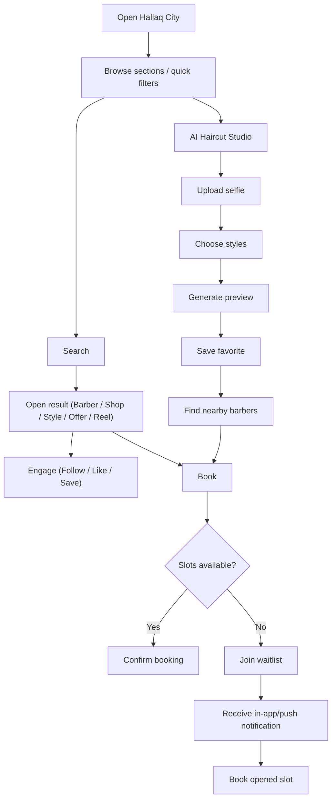

## 1. Product Overview
Hallaq City is a premium, mobile-first discovery hub inside the Hallaq customer app for browsing Bahrain’s grooming ecosystem (barbers, shops, styles, reels, offers, awards) and converting discovery into bookings.
- Primary users: Clients discovering and booking; Barbers and Shops showcasing content; Admin curating the ecosystem.
- Market value: “Bahrain startup premium” UI + real-time marketplace data that drives bookings, retention, and monetization (offers, featured placements, gift cards, loyalty).

## 2. Core Features

### 2.1 User Roles
| Role | Registration Method | Core Permissions |
|------|---------------------|------------------|
| Admin | Internal account | Create/manage Shops, Barbers, Services, Offers, Awards, Styles; moderate reels/reviews; configure rankings |
| Shop Owner | Email/Social | Create/manage Shop profile, Staff, Services, Offers, Products, Reels; reply to reviews; view health score |
| Barber | Email/Social (linked to Shop optional) | Manage barber profile, portfolio/gallery, reels, availability; reply to reviews; view health score |
| Client | Email/Social | Browse, search, filter; like/follow/save; book services; review; join waitlists; buy gift cards; use AI studio |

### 2.2 Feature Modules (Essential Pages + Core Modules)
1. **Hallaq City (Home)**: premium header, search, featured hero carousel, quick filters, sections (Trending, Top Barbers, New Shops, Best Reels, Offers, Style Library, AI Haircut Studio, Awards).
2. **Trending This Week**: ranked lists across Barbers/Shops/Reels with real stats; “View All”.
3. **Top Barbers (List + Filters)**: ranking cards, filters (Top Rated, Most Booked, Trending, Rising Star), profile + book actions.
4. **New Shops**: shop cards with join date, rating, location; profile + maps actions.
5. **Reels (Feed + Viewer)**: TikTok-style infinite feed; open reel; open barber profile; like/comment/save.
6. **Offers**: offer cards with discount, expiry, shop; claim + book actions.
7. **Style Library**: categorized catalog; each style includes media, difficulty, avg Bahrain price, recommended barbers/shops.
8. **Style Details**: hero image, description, gallery/videos, best barbers for style, book now.
9. **AI Haircut Studio**: upload selfie → choose styles → generate AI previews → save favorites → find nearby barbers → book.
10. **Barbers For This Style**: distance, rating, price range, availability; book/profile/maps actions.
11. **Waitlist System**: join waitlist when fully booked; show position/ETA; auto notify when slot available.
12. **Live Availability**: color-coded badges (Green/Yellow/Red) updated automatically from availability + bookings.
13. **Hallaq Awards**: categories; award detail includes winner photo/stats/reason.
14. **Hallaq Levels (Loyalty)**: Silver/Gold/Platinum, progress, rewards/referrals/benefits pages.
15. **Gift Cards**: purchase flow, send to friend, redeem flow.
16. **Home Service**: list only home-service enabled shops; distance, visit fee, availability; book home visit.
17. **Business Health Score**: dashboards for shops/barbers with score (0–100) and metric breakdown.
18. **Review Replies**: threaded public replies by barbers/shops.

### 2.3 Page Details
| Page Name | Module Name | Feature description |
|-----------|-------------|---------------------|
| Hallaq City (Home) | Header | Title “HALLAQ CITY”, subtitle “Discover Bahrain’s Grooming Scene”, premium spacing, dark-mode ready |
| Hallaq City (Home) | Search | Search barbers/shops/styles/offers, instant results + navigation to detail pages |
| Hallaq City (Home) | Featured Hero | Auto-rotating clickable banners (Best Barber/Top Shop/Award Winner/Trending Style/Upcoming Event) |
| Hallaq City (Home) | Quick Filters | All/Barbers/Shops/Styles/Offers/Awards/Reels, instant filtering without route breaks |
| Hallaq City (Home) | Trending This Week | Ranked cards (#1–#3), real stats (views/bookings/likes/followers), “View All” |
| Top Barbers | Ranking Cards | Photo, verified badge, rating, followers, bookings; Book + Profile |
| New Shops | Shop Cards | Cover, logo, rating, location, join date; View Profile + Open Maps |
| Best Reels | Reel Cards | Thumbnail + views/likes/comments; open viewer; infinite feed (no blank cards) |
| Current Offers | Offer Cards | Banner, discount, shop, expiry; Claim + Book |
| Style Library | Catalog | Category tabs, grid cards, media preview; open Style Details |
| Style Details | Detail | Hero image + description + gallery/videos + recommended barbers/shops; Book Now |
| AI Haircut Studio | Upload/Generate | Upload selfie, choose styles, generate preview, save, compare/swipe; route-complete flow |
| Waitlist | Join/Status | Position + ETA; notification when slot opens; one-tap booking from notification |
| Awards | Listing/Detail | Categories and winner details with premium cards |
| Levels | Progress | Tier progress bar + rewards/referral/benefits routes |
| Gift Cards | Purchase/Send/Redeem | Buy, send link/code, redeem to wallet/checkout |
| Home Service | Filtered List | Only enabled shops; book home visit |
| Business Health Score | Dashboard | Score gauge, metrics list, trends (optional), actions to improve |
| Review Replies | Threads | Review + nested replies, public visibility |

## 3. Core Process
Key user flows:
- Discovery → Search/Filter → Open barber/shop/style/reel → Follow/Save → Book service.
- Style discovery → Style details → Nearby barbers for style → Book or Join waitlist.
- Offers → Claim → Book with offer applied.
- AI Studio → Upload selfie → Generate previews → Save style → Find barber → Book.
- Fully booked → Join waitlist → Receive in-app/push notification → Book available slot.

## 4. User Interface Design

### 4.1 Design Style
- Layout: mobile-first (iPhone 15 Pro), white premium background, card-based sections, fixed bottom navigation (Home/Discover/Hallaq City/Bookings/Profile).
- Accents: Hallaq Gold #D4AF37 for active states, CTAs, badges; neutral grays for text hierarchy; subtle separators.
- Cards: 20–28px rounded corners, smooth shadows, “premium glass”/soft elevation, no overflow, no broken grids.
- Typography: clear hierarchy (title/subtitle/section headers/captions), bilingual support (Arabic/English), consistent line-height and letter spacing.
- Motion: premium micro-interactions (tap feedback, subtle scale, shimmer skeletons, carousel auto-rotate, smooth list transitions).
- States: skeleton loaders for all network content; empty states only when truly no data; no “Could not load” raw errors.

### 4.2 Page Design Overview
| Page Name | Module Name | UI Elements |
|-----------|-------------|-------------|
| Hallaq City (Home) | Bottom Nav | Persistent, active icon highlight for Hallaq City, safe-area padding, no route flicker |
| Hallaq City (Home) | Hero Carousel | Large premium cards, page indicators, auto-rotate, click-through |
| Reels | Viewer | Full-bleed media, overlay stats + actions, swipe/scroll feed, no blank placeholders |
| Style Library | Catalog | Category chips, image-forward cards, quick preview, premium spacing |
| AI Studio | Studio UI | Stepper, upload card, gallery of generated previews, compare/swipe interactions |
| Awards/Levels/Gift Cards | Premium Modules | Gold accents, rich cards, gradients kept subtle, consistent spacing |

### 4.3 Responsiveness
- Mobile-first only; supports small/large devices with fluid spacing and safe-area aware bottom navigation.
- Dark mode ready: full color tokens; images and overlays remain legible; gold accent preserved with adjusted contrast.
- Arabic/English: RTL/LTR layout direction support with mirrored paddings and icon placement where appropriate.
