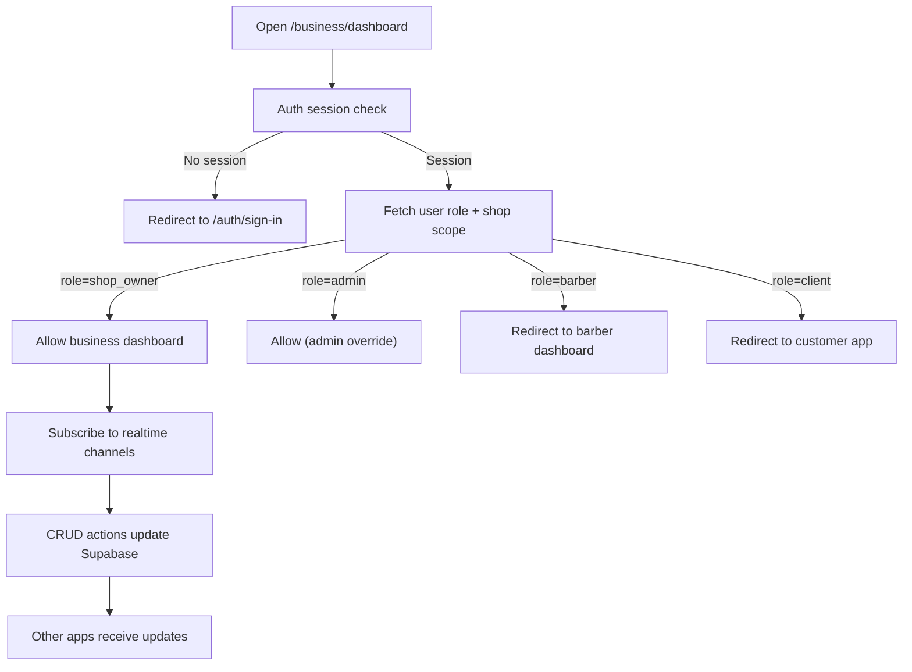

## 1. Product Overview
Create a separate, premium desktop web dashboard for shop owners that uses the existing Supabase backend and data, without modifying the current mobile app experience.
- Target users: Shop owners (primary), Admins (override access)
- Value: A production-ready, desktop-first SaaS dashboard (Fresha/Booksy quality) with realtime operations and complete CRUD across shop operations

## 2. Core Features

### 2.1 User Roles
| Role | Access Method | Core Permissions |
|------|---------------|------------------|
| shop_owner | Existing Supabase auth | Full access to shop dashboard scope (owned/assigned shop data only) |
| admin | Existing Supabase auth | Admin override access to shop dashboard (debug/support) |
| barber | Existing Supabase auth | Must not access this dashboard; redirect to barber dashboard |
| client | Existing Supabase auth | Must not access this dashboard; redirect to customer app |

### 2.2 Feature Module
1. **Desktop Web Dashboard Shell**: premium luxury theme, collapsible left sidebar, top header with global search, notifications, messages, quick actions
2. **Dashboard Home (KPIs)**: realtime KPI cards, charts, today schedule, upcoming bookings, reviews snippets, quick actions
3. **Bookings Management**: live bookings table, status pipeline (upcoming/in progress/completed/cancelled/rescheduled/no show), reschedule/cancel/assign barber, realtime sync across all apps
4. **Smart Calendar**: day/week/month views, drag & drop booking moves, conflict prevention, availability calculations, slot blocking
5. **Barber Management**: CRUD barbers, activation, assignment/transfer, working hours, vacations, performance & revenue tracking
6. **Services**: CRUD services, categories, duration, price, images, offers, visibility toggle, realtime sync
7. **Products**: inventory, stock, pricing, orders, low-stock alerts, categories, images, realtime sync
8. **Offers**: create/schedule/expire offers, targeting, offer analytics
9. **Reels Center**: upload/manage reels, realtime publishing, metrics (views/likes/comments/shares/saves/reach/trending score)
10. **Customers**: profiles, booking history, favorites, spending, reviews, loyalty points, notes
11. **Reviews**: list, reply, report, rating trends & analytics
12. **Messages & Notifications**: realtime inbox and notifications stream, broadcasting, appointment reminders
13. **Reports & Analytics**: charts, filters, export (PDF/Excel/CSV) based on real data
14. **QR Center**: generate & download shop/barber QRs, track scans analytics
15. **Settings**: shop profile, branding (logo/cover), working hours, branches, theme settings, notification settings
16. **Responsiveness & Routing**: desktop-first for ≥1024px, responsive tablet layout, redirect mobile to existing mobile dashboard

### 2.3 Page Details
| Page Name | Module Name | Feature description |
|-----------|-------------|---------------------|
| /business/dashboard | Dashboard Home | KPI cards, schedule, charts, quick actions, realtime streams |
| /business/bookings | Bookings Table | Filter/sort, status updates, assign barber, reschedule, cancel, realtime updates |
| /business/calendar | Calendar | Day/week/month views, drag/drop, conflict prevention, slot blocking |
| /business/barbers | Barbers | CRUD, activate/deactivate, working hours/vacations, performance analytics |
| /business/services | Services | CRUD, categories, duration/price, images, offers, visibility toggle |
| /business/products | Products | Inventory, pricing, orders, low stock, categories, images |
| /business/offers | Offers | Create/schedule/expire/target offers, offer analytics |
| /business/reels | Reels Center | Upload, manage, realtime publish, engagement analytics |
| /business/customers | Customers | Profiles, history, spending, reviews, loyalty, notes |
| /business/reviews | Reviews | View/reply/report, rating trends |
| /business/messages | Messages | Conversations, broadcasts, reminders |
| /business/notifications | Notifications | Realtime stream, filters, mark-read |
| /business/reports | Reports | Revenue/bookings/services/products/reels/customers/barbers growth, exports |
| /business/analytics | Analytics | Deep analytics views and drilldowns |
| /business/qr | QR Center | Generate/download QRs, scan analytics |
| /business/settings | Settings | Shop profile/branding/hours/branches/theme/notification preferences |
| /business/support | Support | Support access, links, system status visibility |

## 3. Core Process
Primary flows:
- Shop owner signs in → role check → desktop dashboard entry point → navigates modules in sidebar → all actions perform real CRUD in Supabase → realtime updates propagate to other apps.
- Bookings are updated by client/barber/shop → all dashboards reflect updates instantly via Supabase Realtime subscriptions.

## 4. User Interface Design

### 4.1 Design Style
- Theme: Premium luxury (Fresha/Booksy quality)
- Background: #0B0B0B
- Cards: #151515
- Borders: #252525
- Accent gold: #F4C542
- Text: white (high contrast), secondary text with muted greys
- Radius: 16px
- Motion: smooth transitions, subtle hover elevation, table row micro-interactions, skeleton loading (no placeholders for content)
- Layout: desktop-first, dense-but-readable information architecture, strong visual hierarchy

### 4.2 Page Design Overview
| Page Name | Module Name | UI Elements |
|-----------|-------------|-------------|
| Shell | Left Sidebar | Logo, shop name, verification badge, collapsible navigation, logout |
| Shell | Top Header | Global search, notifications, messages, quick actions, current shop switcher, profile menu, “New Booking”, “Upload Reel” |
| Dashboard | KPIs | Large KPI cards, sparkline charts, realtime delta indicators |
| Bookings | Data Table | Status tabs, filters, bulk actions, realtime row updates, inline status changes |
| Calendar | Scheduling | Grid calendar, drag/drop cards, conflict warnings, slot blocking UI |
| Settings | Forms | Validations, image uploads, save/publish patterns, optimistic UI with rollback |

### 4.3 Responsiveness
- Desktop (≥1024px): full professional dashboard with sidebar + header + multi-column layouts
- Tablet: responsive grid and simplified density; keep core navigation and actions accessible
- Mobile: redirect to the existing mobile dashboard (no mobile-stretched UI for this route set)
