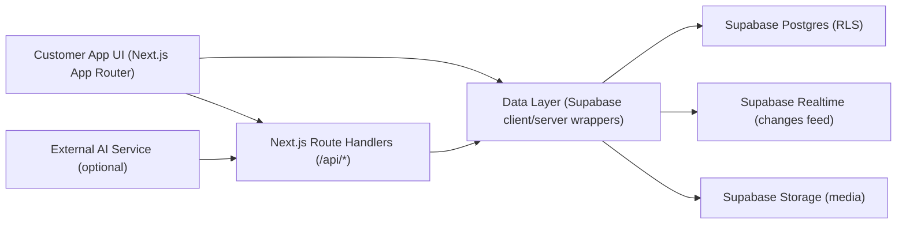
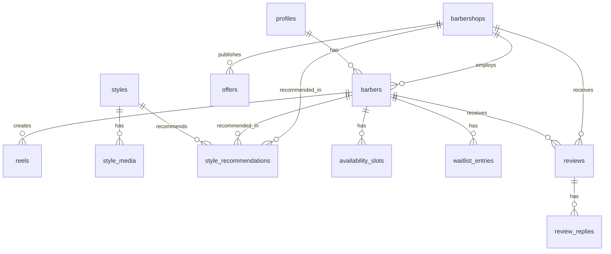

## 1. Architecture Design

Hallaq City is implemented as a feature area within the existing Next.js customer app, backed by Supabase (Postgres + Auth + Storage + Realtime). Admin/shop/barber portals manage content; customer app consumes it via server routes and/or Supabase client queries, with realtime updates where needed.



## 2. Technology Description

* Frontend: Next.js (App Router) + React + TypeScript

* Styling: Tailwind CSS (shared preset in packages/ui) + design tokens for light/dark + premium motion via CSS

* Data: Supabase (Auth, Postgres, Realtime, Storage) via shared package \[packages/supabase]

* Media: Supabase Storage for reels thumbnails, style media, profile photos

* i18n: Existing EN/AR support; RTL-aware UI and locale route integration

* Realtime: Supabase Realtime for Hallaq City sections (offers, reels, availability, waitlists) without manual refresh

* Notifications: In-app notification center + push (where available); waitlist triggers from DB events

## 3. Route Definitions

Routes are added to the customer app and integrated into the persistent bottom navigation.

| Route                                   | Purpose                                          |
| --------------------------------------- | ------------------------------------------------ |
| /home                                   | Customer home                                    |
| /discover                               | Discovery                                        |
| /city                                   | Hallaq City home (main feature)                  |
| /city/trending                          | Trending this week (barbers/shops/reels ranking) |
| /city/barbers                           | Top Barbers list with filters                    |
| /city/shops/new                         | New Shops list                                   |
| /city/reels                             | Reels feed                                       |
| /city/offers                            | Current offers list                              |
| /city/styles                            | Style library                                    |
| /city/styles/\[id]                      | Style details                                    |
| /city/ai-studio                         | AI Haircut Studio                                |
| /city/styles/\[id]/barbers              | Barbers for this style                           |
| /city/waitlist/\[barberId]              | Waitlist join/status                             |
| /city/awards                            | Awards listing                                   |
| /city/awards/\[id]                      | Award detail                                     |
| /city/levels                            | Loyalty levels hub                               |
| /city/gift-cards                        | Gift cards purchase/send/redeem                  |
| /city/home-service                      | Home service eligible shops                      |
| /city/health-score/(barber\|shop)/\[id] | Business health score dashboard                  |
| /city/reviews/\[entityType]/\[id]       | Reviews + replies thread                         |

## 4. API Definitions

The codebase may use direct Supabase queries in server components; route handlers are used when:

* composing multiple queries into one payload

* applying ranking calculations server-side

* generating signed URLs for private media

* integrating AI preview generation

* enforcing additional validation beyond RLS

### 4.1 Types (Domain)

```ts
export type CityQuickFilter =
  | "all"
  | "barbers"
  | "shops"
  | "styles"
  | "offers"
  | "awards"
  | "reels";

export type AvailabilityStatus = "available_now" | "busy_today" | "fully_booked";

export type CityStatBlock = {
  views: number;
  likes: number;
  followers: number;
  bookings: number;
};
```

### 4.2 Route Handlers (Proposed)

| Endpoint                | Method | Purpose                                                           |
| ----------------------- | ------ | ----------------------------------------------------------------- |
| /api/search             | GET    | Unified search across barbers/shops/styles/offers                 |
| /api/city/featured      | GET    | Hero carousel items (best barber/shop/award/trending style/event) |
| /api/city/trending      | GET    | Trending lists + computed ranks/stats                             |
| /api/city/reels         | GET    | Paginated reels feed with stable ordering                         |
| /api/city/waitlist/join | POST   | Join waitlist for barber/slot                                     |
| /api/city/ai/generate   | POST   | Generate AI haircut previews for uploaded selfie                  |

## 5. Data Model

This feature builds on existing tables and extends where needed. Realtime subscriptions listen to changes for immediate UI updates.

### 5.1 ER Diagram (Conceptual)



### 5.2 Table Additions / Extensions (High Level)

* styles: add difficulty, avg\_price\_bhd, category, hero\_media

* style\_media: (style\_id, type=image|video, storage\_path, sort\_order)

* style\_recommendations: (style\_id, barber\_id?, shop\_id?, rank, reason)

* reels: ensure metrics (views/likes/comments), barber\_id, storage paths

* offers: discount\_text, expiry\_at, shop\_id, banner\_media

* availability\_slots: normalized availability per barber; computed status mapping

* waitlist\_entries: barber\_id, customer\_id, status, position, eta\_minutes, created\_at

* review\_replies: review\_id, author\_profile\_id, body, created\_at

* awards: category, winner\_entity\_type, winner\_id, stats\_json, reason

* loyalty\_ledger / tiers: support levels progress and benefits

* gift\_cards: purchase, balance, redeem, recipient delivery metadata

* home\_service\_settings: per shop toggle + visit\_fee + radius\_km

* business\_health\_metrics: materialized metrics inputs + score calculation

## 6. Realtime Strategy

* Subscribe to offers/reels/availability/waitlists changes scoped to the relevant screen.

* Use optimistic updates for likes/follows/saves; reconcile via realtime events.

* Rankings and “Trending This Week” can be recomputed server-side periodically and cached, with realtime invalidation on key events (views/bookings).

## 7. Performance and Quality Gates

* Mobile-first layout locked to safe-area and persistent bottom navigation; no overflow, no layout shifts.

* Skeleton loaders for all section content; deterministic card heights to avoid jank.

* Media: responsive images, prefetch hero media, lazy-load reels thumbnails, use signed URLs if private.

* Error handling: user-friendly errors with retry; never show raw “Could not load” screens.

