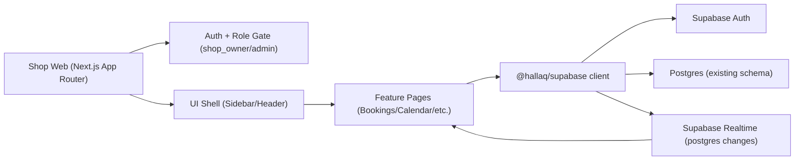
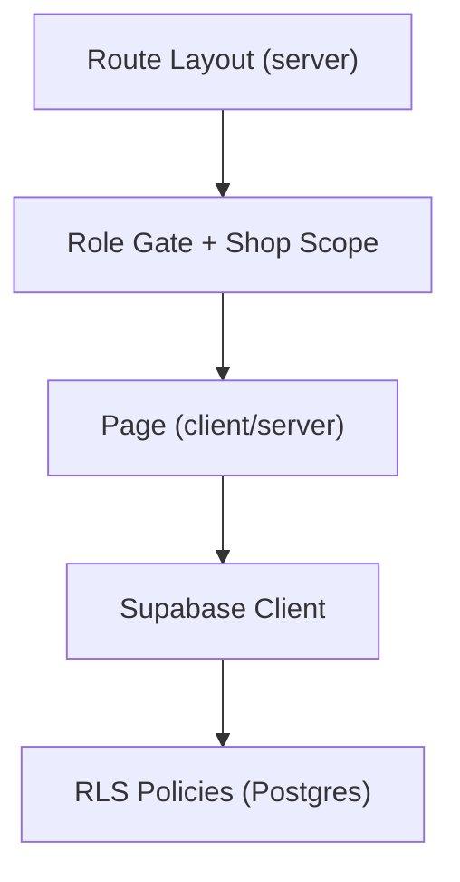
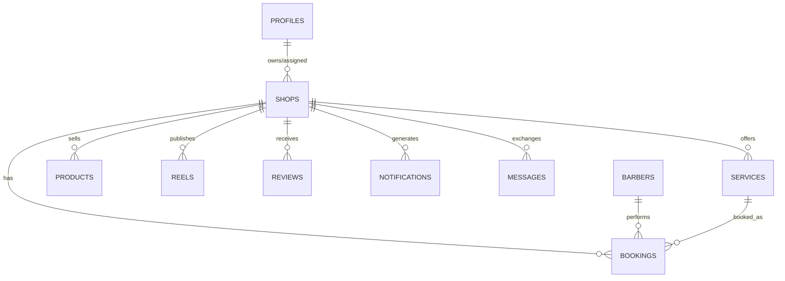

## 1. Architecture Design
This dashboard is a new desktop-first route area inside the existing Next.js Shop app, reusing the same Supabase backend, auth, RLS policies, and realtime streams. No new database and no duplicate backend services.



## 2. Technology Description
- Frontend: Next.js@15 (App Router) + React@19 + TypeScript
- Styling: TailwindCSS (existing in repo) + CSS variables for theme tokens
- Data access: existing internal package `@hallaq/supabase` (shared across apps)
- Realtime: Supabase Realtime channels (postgres changes / presence if already used)
- AuthZ: Supabase Auth + existing role model (shop_owner/admin/barber/client) enforced via:
  - Server-side gate (layout/route protection) to prevent data leakage
  - Supabase RLS policies (source of truth) for table access and shop scoping

## 3. Route Definitions
All routes are desktop-first and live under a dedicated prefix. Mobile devices are redirected to the existing mobile dashboard routes.

| Route | Purpose |
|-------|---------|
| /business/dashboard | Dashboard home KPIs and realtime overview |
| /business/bookings | Booking management table and actions |
| /business/calendar | Day/week/month calendar with scheduling actions |
| /business/barbers | Barber management and performance |
| /business/services | Service CRUD and categories |
| /business/products | Product inventory/orders/stock |
| /business/offers | Offers lifecycle and analytics |
| /business/reels | Reels upload and management |
| /business/customers | Customer profiles and history |
| /business/reviews | Review moderation and replies |
| /business/messages | Messaging center |
| /business/notifications | Notifications center |
| /business/reports | Reporting and exports |
| /business/analytics | Analytics dashboards and drilldowns |
| /business/qr | QR generation and scan analytics |
| /business/settings | Shop settings and branding |
| /business/support | Support and help center |

## 4. API Definitions
No new backend API is introduced. The web dashboard consumes existing Supabase data via:
- Typed table queries (select/insert/update/delete) using the existing Supabase client wrapper
- Existing RPC functions (if present) for aggregated analytics where needed
- Postgres change subscriptions for realtime bookings, reviews, messages, and notifications

Type conventions (conceptual):
```ts
export type Role = "shop_owner" | "admin" | "barber" | "client";

export type BookingStatus =
  | "upcoming"
  | "in_progress"
  | "completed"
  | "cancelled"
  | "rescheduled"
  | "no_show";

export type ShopScope = {
  shopId: string;
  role: Role;
  userId: string;
};
```

## 5. Server Architecture Diagram
No new server layer is required. Next.js server components and route handlers (only if already used in the repo) may be used for:
- Secure server-side role gating
- Secure redirects for unauthorized roles
- Export generation endpoints (PDF/CSV/Excel) if the current repo already implements exports via route handlers



## 6. Data Model
This dashboard relies on existing tables and relationships. The exact table names are the current schema in Supabase; the dashboard must not create duplicates.

### 6.1 Data Model Definition


### 6.2 Data Definition Language
No new DDL is required for the dashboard itself. Any missing capabilities must be implemented through incremental migrations in `supabase/migrations/` (only when needed) and must preserve compatibility for:
- Customer app
- Barber dashboard
- Admin dashboard
- Existing shop (mobile) dashboard
